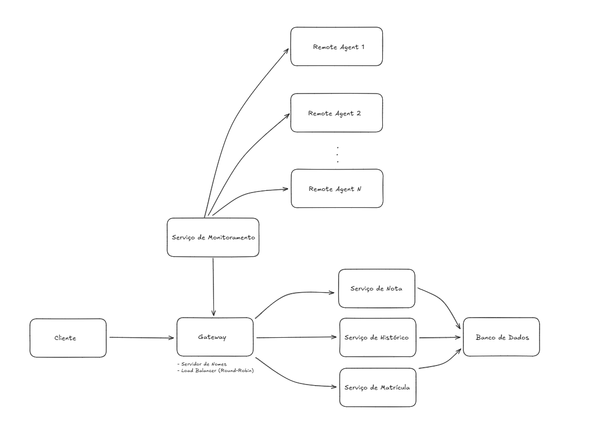

# Distributed Systems Features - Academic Management Platform

A distributed microservices-based system for academic management, implementing fault tolerance, load balancing, and service discovery patterns. The system manages student enrollment, grades, and academic history through a scalable distributed architecture.

## Architecture Overview



The system follows a distributed architecture with the following key components:

- **Gateway with Service Discovery**: Central service registry and load balancer implementing round-robin distribution
- **Remote Agents**: Distributed agents for fault tolerance and automatic service recovery
- **Monitoring Service**: Health monitoring and heartbeat management for all services
- **Microservices**: Three core business services (Enrollment, Grades, Academic History)
- **Database**: PostgreSQL database with Flyway migrations
- **Client**: Gateway-aware client with service location caching

## Project Overview

This project demonstrates advanced distributed systems concepts and patterns applied to an academic management domain. The system provides robust service management for student enrollment, grade management, and academic history tracking while ensuring high availability through fault tolerance mechanisms.

### Key Features

- **Service Discovery**: Automatic service registration and discovery through gateway
- **Fault Tolerance**: Automatic service recovery using remote agents
- **Load Balancing**: Round-robin load distribution across service instances
- **Health Monitoring**: Continuous health checks and heartbeat monitoring
- **Database Migrations**: Automated database schema management with Flyway
- **Client-side Caching**: Service location caching for improved performance
- **Distributed Processing**: Multi-threaded processing across distributed nodes

## Technologies Used

- **Java 17**: Core programming language
- **Maven**: Dependency management and build automation
- **PostgreSQL**: Relational database management
- **Flyway**: Database migration and version control
- **JUnit 5**: Testing framework
- **Socket Programming**: TCP/UDP communication protocols
- **Multithreading**: Concurrent processing capabilities

## System Components

### Core Services

#### 1. Enrollment Service (`MatriculaService`)
- Student course enrollment management
- Registration validation and processing
- Course availability checking

#### 2. Grades Service (`NotaService`)
- Grade recording and management
- Grade calculation and validation
- Academic performance tracking

#### 3. Academic History Service (`HistoricoService`)
- Complete academic transcript generation
- Approved/failed courses tracking
- Current enrollment status

### Infrastructure Components

#### Gateway
- **Service Discovery**: Maintains registry of available services
- **Load Balancing**: Distributes requests using round-robin algorithm
- **Health Monitoring**: Tracks service health and availability

#### Remote Agents
- **Fault Recovery**: Automatically restarts failed services
- **Distributed Deployment**: Manages services across multiple nodes
- **Resource Monitoring**: Tracks system resource utilization

#### Monitoring Service
- **Heartbeat Management**: Continuous health checking
- **Performance Metrics**: Service response time tracking
- **Failure Detection**: Automatic failure detection and notification

## Architecture Patterns

### Microservices Architecture
- **Service Isolation**: Each business capability as independent service
- **Loose Coupling**: Services communicate through well-defined interfaces
- **Technology Diversity**: Each service can use optimal technology stack

### Service Discovery Pattern
- **Dynamic Registration**: Services register themselves at startup
- **Health Checking**: Continuous health monitoring of registered services
- **Load Distribution**: Automatic load balancing across healthy instances

### Remote Agent Pattern
- **Fault Tolerance**: Automatic service recovery without manual intervention
- **Distributed Management**: Service lifecycle management across nodes
- **Resource Optimization**: Dynamic resource allocation based on demand

## Project Structure

```plaintext
ds-features/
├── src/
│   ├── main/
│   │   ├── java/
│   │   │   └── sdProject/
│   │   │       ├── config/          # Configuration management
│   │   │       ├── controllers/     # Business logic controllers
│   │   │       ├── dao/            # Data Access Objects
│   │   │       ├── models/         # Domain models
│   │   │       ├── network/        # Network communication layer
│   │   │       │   ├── client/     # Client implementation
│   │   │       │   ├── discovery/  # Service discovery
│   │   │       │   ├── util/       # Network utilities
│   │   │       │   └── workers/    # Service workers and agents
│   │   │       └── services/       # Business service interfaces and implementations
│   │   └── resources/
│   │       └── db/migration/       # Flyway database migrations
│   └── test/                       # Unit and integration tests
├── docs/
│   ├── Arquitetura.png           # Architecture diagram
│   └── simpleERD.png             # Entity relationship diagram
├── .env_example                   # Environment configuration template
└── pom.xml                       # Maven configuration
```

## Installation and Setup

### Prerequisites
- **Java JDK 17** or higher
- **PostgreSQL 12+** database server
- **Maven 3.6+** for dependency management

### Database Setup

1. Create PostgreSQL database:
   ```sql
   CREATE DATABASE academic_management;
   ```

2. Configure database connection in `.env` file:
   ```bash
   cp .env_example .env
   # Edit .env with your database credentials
   ```

### Application Setup

1. Clone the repository:
   ```bash
   git clone https://github.com/username/ds-features.git
   cd ds-features
   ```

2. Install dependencies:
   ```bash
   mvn clean install
   ```

3. Run database migrations:
   ```bash
   mvn flyway:migrate
   ```

## Running the System

### 1. Start the Gateway (Service Discovery)
```bash
java -cp target/classes sdProject.network.discovery.Gateway
```

### 2. Start Remote Agents
```bash
# Agent 1
java -cp target/classes sdProject.network.workers.agents.RemoteAgent

# Agent 2 (different port)
java -cp target/classes sdProject.network.workers.agents.RemoteAgent
```

### 3. Start Monitoring Service
```bash
java -cp target/classes sdProject.network.workers.monitor.MonitoringService
```

### 4. Start Business Services
```bash
# Enrollment Service
java -cp target/classes sdProject.network.workers.MatriculaWorker

# Grades Service
java -cp target/classes sdProject.network.workers.NotaWorker

# History Service
java -cp target/classes sdProject.network.workers.HistoricoWorker
```

### 5. Run Client Application
```bash
java -cp target/classes sdProject.network.client.Cliente
```

## Usage Examples

### Student Enrollment
```java
// Enroll student in course
Matricula matricula = new Matricula();
matricula.setAlunoId(1);
matricula.setCursoId(101);
matriculaService.matricularAluno(matricula);
```

### Grade Management
```java
// Record student grade
notaService.adicionarNota(studentId, disciplineId, grade);
```

### Academic History
```java
// Generate complete academic transcript
Map<Disciplina, Double> historico = historicoService.gerarHistoricoCompleto(studentId);
```

## Testing

### Run Unit Tests
```bash
mvn test
```

### Load Testing
```bash
java -cp target/classes sdProject.network.client.NotaLoadTest
```

### Integration Testing
```bash
mvn verify
```

## Performance Features

### Fault Tolerance
- **Automatic Recovery**: Failed services are automatically restarted by remote agents
- **Health Monitoring**: Continuous monitoring prevents cascading failures
- **Graceful Degradation**: System continues operating with reduced service instances

### Scalability
- **Horizontal Scaling**: Easy addition of new service instances
- **Load Distribution**: Automatic load balancing across available instances
- **Resource Optimization**: Dynamic resource allocation based on system load

### Reliability
- **Service Registry**: Centralized service discovery and health tracking
- **Connection Pooling**: Efficient network resource management
- **Timeout Handling**: Robust timeout and retry mechanisms

## Technical Highlights

### Distributed Systems Patterns
- **Service Discovery**: Dynamic service registration and location
- **Circuit Breaker**: Fault tolerance and service isolation
- **Load Balancing**: Traffic distribution across service instances
- **Health Check**: Continuous service health monitoring

### Network Communication
- **TCP/UDP Protocols**: Efficient binary communication
- **Serialization**: Custom object serialization for network transport
- **Connection Management**: Pooled connections for optimal performance

### Concurrency
- **Thread Pool Management**: Efficient resource utilization
- **Asynchronous Processing**: Non-blocking operation handling
- **Concurrent Collections**: Thread-safe data structures

## Educational Value

This project demonstrates:
- **Distributed Systems Architecture**: Real-world microservices implementation
- **Fault Tolerance Patterns**: Practical resilience engineering
- **Network Programming**: Low-level socket programming and protocols
- **Service Design**: RESTful service principles and API design
- **Database Integration**: ORM patterns and migration strategies
- **Testing Strategies**: Unit, integration, and load testing approaches
